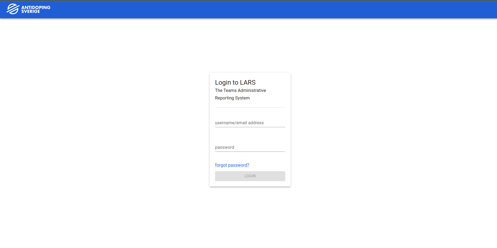
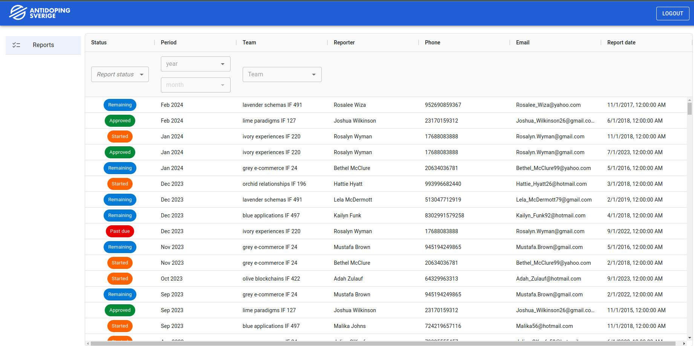
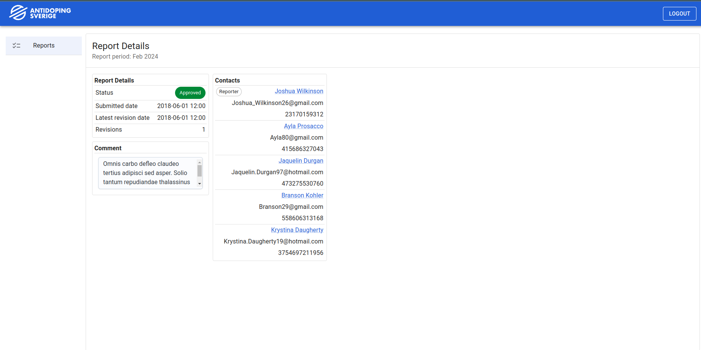
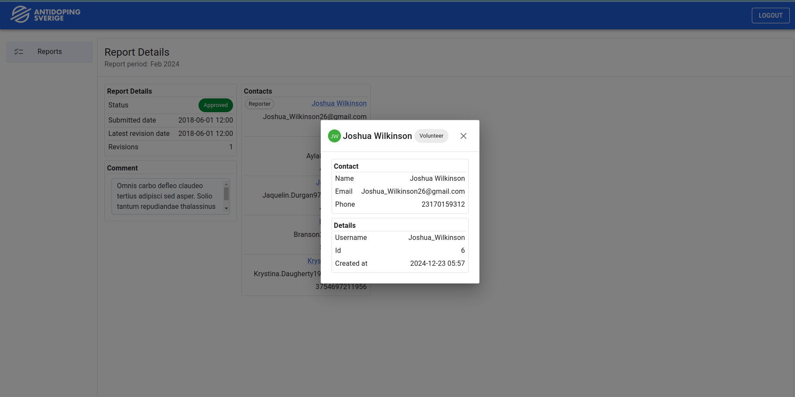

# L.A.R.S Frontend

## Overview

I wanted to experiment with ag-grid and serverside filtering/sorting/ordering as well as websockets and streams, which is the reason for the chosen technologies of this project.
The main point of the application is for administrators to keep track of different teams and their reports.

The administrator of a team will report their presence at certain location (in a different system) and that report will be visible in this UI

### The Good
**1. Typesafe**

The project is typesafe from BE to FE, making sure that any contract/API changes are a compile time error - not a runtime crash 

**2. High-Performance grid**

The main report grid is using ag-grid and infinity scroll to only get a couple of rows, then loads more rows as the user scrolls.
It's using a message to the BE to subscribe to the "getReports" stream, and then it subscribes an observable to that stream, updating the data as soon as new rows are available 

**3. Folder structure**

I think the project is well-structured, separating specific feature code, reusable components, and non UI parts in an intuitive way

**4. Lazy-loading**

The different pages are lazy loaded to decrease the initial bundle size

**Login screen**

**Overview of reports**

**Report details**

There's a lot of empty space here for a feature that never got developed

**User details**

### The Bad
- No automated tests
- There's a couple of inline-styles here and there
- Some component's have a lot of logic or inline function definitions that I would prefer to extract into testable functions
- the service/state layer separation makes little sense since most of the heavy lifting is done in the socketService, and most services are just a thin abstraction on top of that
- UI is **very** bare-bones, but functional
- A lot of features were started but never finished

## Local Development
1. Install packages with `yarn install`
2. Run the [backend](https://github.com/CeasarCyrillus/lars2_backend]) (Make sure that the BE and FE repos are in the same folder - the shared types in the BE repo is linked to with a relative path. Very bad , I know)
3. Run the development server with `yarn start`
4. Login with "admin" and "pwd"

